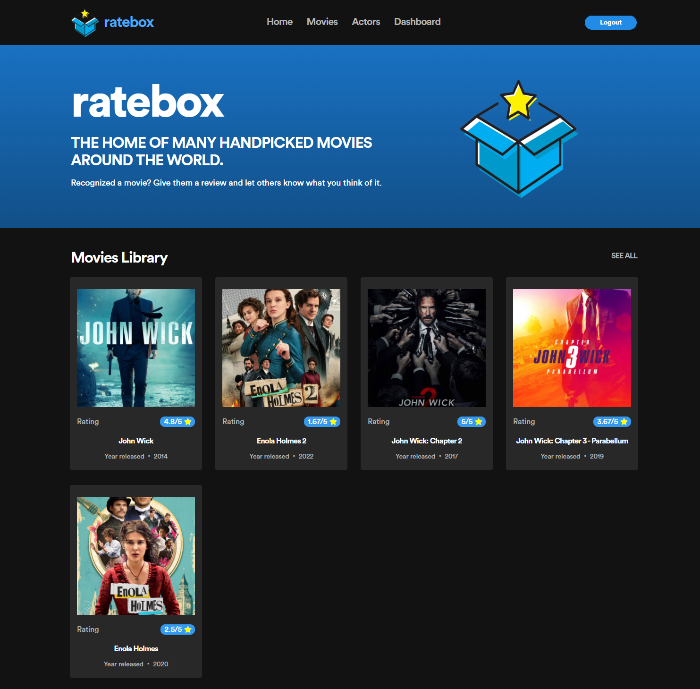

<h1 align="center">ratebox</h1>

<p align="justify">A digital streaming platform that allows users view actors, movies, and review them with up to 5 star rating. It is also a software solution for Digital Streaming System that allows admistrators to manage movies, actors, users, and user movie reviews. It is also a place for many handpicked movies around the world. </p>



## ⚒️ Built with the following technologies:

<ul>
    <li>React - Typescript</li>
    <li>HTML - SCSS</li>
    <li>Mantine UI</li>
    <li>Redux Toolkit</li>
    <li>Loopback 4 + Authentication and Authorization</li>
    <li>MongoDB</li>
    <li>Sonarqube</li>
    <li>React Testing Library + Jest + Mock Service Worker</li>
</ul>

## ✨ Features

<ul>
    <li>View Movies (Users)</li>
        <ul>
            <li>View movie details such as rating, description and more.</li>
            <li>Search for movies.</li>
            <li>View actors that are part of the movie.</li>
            <li>View admin approved user reviews.</li>
        </ul>
    <li>Give Movie Reviews (Users)</li>
        <ul>
            <li>Submit a review of a movie.</li>
            <li>Requires account login and activation from the admin.</li>
            <li>Created review will be subjected for admin approval.</li>
        </ul>    
    <li>View Actors (Users)</li>
        <ul>
            <li>With actor details such as name, link, etc.</li>
            <li>Search for actors.</li>
            <li>View the movies that the actor is part of.</li>
        </ul>
    <li>A Dashboard for managing movies, actors, reviews, and users. (Admin)</li>
        <ul>
            <li>Perform CRUD operations on all table management.</li>
            <li>Activate/ Deactivate user.</li>
            <li>Approve/ Disapprove movie reviews done by users.</li>
        </ul>   
    <li>The list goes on....</li>    
</ul>

## Requirements

A running instance of a MongoDB server is required for the app to start. The MongoDB is used for storing all data.

## 🛠️ Installation and Set Up

Do the following to clone and start the project. Install all dependencies, both frontend and backend.

```sh
$ git clone https://github.com/Bernz322/digital-streaming-system.git
$ cd digital-streaming-system
$ cd frontend
$ nvm install
$ npm i
$ cd ..
$ cd backend
$ npm i
```

Open two terminals and cd to frontend and backend folders respectively and start them

```sh
$ cd frontend
$ npm start
```

```sh
$ cd backend
$ npm start
```

## Usage

The frontend app will be running at http://localhost:3005. The backend together with the API Explorer will be at http://localhost:3000/explorer/.

The app will have no data initially. The first user who will register will be treated as the root admin. This admin cannot be deleted nor edited.

A separate directory named 'db' in the root folder contains JSON files of several collections that the app uses. Import them to mongodb with a database named 'digital-streaming-system'.

## Models


This app has the following models:

1. `User` - a model representing the users of the app.
2. `UserCredentials` - a model representing sensitive credentials like a password of the users.
3. `Movies` - a model representing the movies of the app.
4. `Actors` - a model representing the actors of the app.
5. `MovieCast` - a model to represent the actors of a movie and vice versa.
6. `Reviews` - a model representing the reviews of a user to a movie.

`User` is marked as having one `UserCredentials` model using the `@hasOne` decorator. The `belongsTo` relation for `UserCredentials` to `User` has not been created to keep the scope smaller.

`Movies` is marked as having many `Actors` through the `MovieCast` model using the `@hasMany(() => Actors, { through: {model: () => MovieCast})` to denote that it has many to many connection with the `Actors` model. It is also marked as having many `Reviews` using the `@hasMany` decorator.

Similar to the `Movies` model, the `Actors` model is also marked as having many `Movies` through the `MovieCast` model using the `@hasMany(() => Movies, { through: {model: () => MovieCast})` to denote that it has many to many connection with the `Movies` model.

`Reviews` is marked as belonging to the `User` model by the use of the `@belongsTo` model decorator. Correspondingly, the `User` model is marked as having many `Reviews` using the `@hasMany` model decorator.

## Controllers

Controllers expose API endpoints for interacting with the models and more.

In this app, there are four controllers:

1. `user` - controller for creating users, fetching user info, updating user info, deleting users, and logging in.
2. `movies` - controller for creating movies, fetching movie info, searching movies, updating movie info, and deleting movies.
3. `actors` - controller for creating actors, fetching actor info, searching actors, updating actor info, and deleting actors.
4. `reviews` - controller for creating, updating (approval), deleting movie reviews.

## Services

Services are modular components that can be plugged into a LoopBack application in various locations to contribute additional capabilities and features to the application.

This app has five services:

1. `services/user.service` - responsible for verifying if user exists and the submitted credentials matches that of an existing user. It is also responsible for creating a profile to be used for the generation of the JWT.
2. `services/jwt.service` - responsible for generating and verifying JSON Web Token with additional `role` field for authorization.

## Authentication

_Note: This app contains a `login` endpoint ('users/login') for the authentication._

The endpoint for logging in a user is a `POST` request to `/users/login`.

Once the credentials are extracted, the logging-in implementation at the controller level is just a four step process. This level of simplicity is made possible by the use of the `UserService` service provided by `@loopback/authentication`. In this app, these services are customized to cater the needed implementation.

1. `const user = await this.userService.verifyCredentials(credentials)` - verify the credentials.
2. `const userProfile = this.userService.convertToUserProfile(user)` - generate user profile object.
3. `const token = await this.jwtService.generateToken(userProfile)` - generate JWT based on the user profile object.
4. `return token and user` - send JWT and minimal user data.

## Authorization

Endpoint authorization is done using the [@loopback/authorization](https://github.com/strongloop/loopback-next/tree/master/packages/authorization). Wherein, the `@authorize` decorator is used to restrict controller access with the `allowedRoles` property.

A customized authorization provider is binded to `authorizationProviders.my-authorizer-provider` to cater the roles of a user decoded from the JWT token.

Thee app has two roles: `admin`, and `user`. All get request endpoints of movies and actors controllers has no authorization instilled to it as it is a public route.

## Tests

The frontend app has Unit test with backend API mocks using Mock Service Worker integrated to it. The backend however is not tested.

To execute the test, both frontend and backend must run simultaneously. On another terminal, run:

```sh
$ npm test
```

To see the test coverage, run:

```sh
$ npm run coverage
```

### Sonarqube Scanner Results

For the frontend, only the components and pages are unit tested with the coverage of more than 50%.

The backend is not tested and was only scanned for code smells and vulnerabilities.

